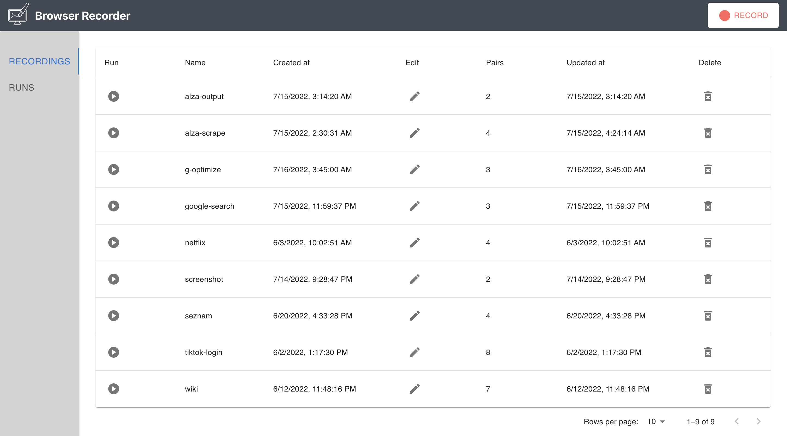
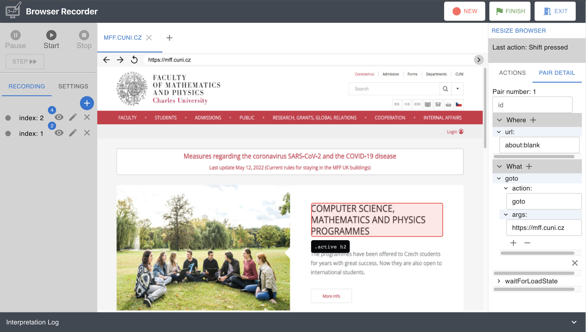

# The web browser recorder
The web browser recorder is an easy-to-use **RPA tool** designed as a web application that enables the user to record a workflow in the simulated browser GUI,
running [Playwright](https://playwright.dev/) automation framework on the background.
The workflow is being recorded in the [Web Automation Workflow](https://github.com/barjin/wbr/blob/main/docs/wbr-interpret/waw_definition.md)
(waw) format. This automation format is unique in that it can be interpreted in a non-linear manner.
As a result, a workflow may now be designed as a deterministic finite automaton that matches numerous states according to the conditions
rather than just being a set of sequential rules.
We achieve that by processing the waw file through a [wbr-interpreter](https://www.npmjs.com/package/@wbr-project/wbr-interpret) library.
# User Manual
## How to run
First, the npm packages modules to be installed.
```bash
npm install --legacy-peer-deps
```
The application can be started by running the following command:
```bash
npm start
```
This command will start the server as well as the client side.
The application can be then accessed by navigating to the following URL: `http://localhost:3000/`.
## How to use the recorder
After a successful start of the application, you will be greeted by the initial page containing all
previously recorded workflows. You can access the runs' table by clicking on the `Runs` tab in the left sidebar.
Try to explore the run's content by expanding one of the collapsible rows.


From The initial page it is possible to start a new recording session, or to continue with a previously recorded one.
Either by clicking the new recording button or by clicking the edit button in the table.

This will take you to the recording page.


The recording page consists of four main structures.
The left side panel with a recording preview, setting and interpretation controls, the simulated browser
window, the right side panel and the interpretation log.

You can add a new rule to the workflow either manually by clicking the add button or by interacting with the simulated browser.
Interactions will create the rules automatically.
Furthermore, the right side panel that allows you to add a custom action rule to the workflow or 
have a look at the pair's detail view.

## Recorded workflow file example
```json
{
  "recording_meta": {
    "name": "google",
    "create_date": "7/4/2022, 11:39:43 PM",
    "pairs": 2,
    "update_date": "7/4/2022, 11:39:44 PM"
  },
  "recording": {
    "workflow": [
      {
        "where": {
          "url": "https://www.google.com/",
          "selectors": [
            "#L2AGLb > .QS5gu"
          ]
        },
        "what": [
          {
            "action": "click",
            "args": [
              "#L2AGLb > .QS5gu"
            ]
          },
          {
            "action": "waitForLoadState",
            "args": [
              "networkidle"
            ]
          }
        ]
      },
      {
        "where": {
          "url": "about:blank"
        },
        "what": [
          {
            "action": "goto",
            "args": [
              "https://google.com"
            ]
          },
          {
            "action": "waitForLoadState",
            "args": [
              "networkidle"
            ]
          }
        ]
      }
    ]
  }
}
```
This workflow navigates to the Google homepage and then clicks on the cookie banner button.

# Solution
The objective of this project is to provide a self-contained tool that can generate waw format data and is
easy-to-use for Robotic process automation. This tool should be helpful for various interaction with the generated workflows.
Such as its editing, running, and visualizing.

Web browse recorder completely removes the need for writing code to automate web scenarios. This is very useful
for non-technical users and automation community as well as for the engineers, which work will be more efficient
and reliable. On the other hand, there is a certain amount of hardship being faced. Especially when designing such
a tool. Many user options and various for hundreds of different use cases are involved. This is the main reason why
I chose to create a web application with simulated browser GUI.

In order to reach out to a broader audience, I have created the recorder in form of a web application. Even though, this approach
brings difficulties with the user-browser interaction, having a client-server application provides the needed features for workflow management and easy interaction with the user.
Whereas a browser extension has a better access to the state of the browser and it's pages/dom. It is often hard to
navigate through a recording extension and the developers face a problem creating a good user experience interface.
This solution is not perfect, but it is a good start from which we can expand the possibilities of the recorder maintaining
the interface balanced and intuitive.

## Documentation

### Back-end
A generated documentation is available at `./docs/index.html`.

### API Documentation

**Record** endpoints API consists of the following endpoints:
- GET - /record/start: Starts the new remote browser recording session for editor.
- POST - /record/start: Starts the new remote browser recording session for editor with custom browser launch options.
- GET - /record/stop/:browserId: Terminates the remote browser recording session.
- GET - /record/active: Returns the active browser id.
- GET - /record/active/url: Returns the active browser's url.
- GET - /record/active/tabs: Returns the active browser's tabs.
- GET - /record/interpret: Starts the interpretation of the currently generated workflow.
- GET - /record/interpret/stop: Stops the currently in progress interpretation.

**Storage** endpoints API consists of the following endpoints:
- GET - /storage/recordings: Gets an array of all stored recordings.
- DELETE - /storage/recordings/:fileName: Deletes a recording with fileName name from the storage.
- GET - /storage/runs: Gets an array of all stored runs.
- DELETE - /storage/runs/:runName: Deletes a run with runName name from the storage.
- PUT - /storage/runs/:recordingName: Creates a new run with recordingName name from the storage.
- POST - /storage/runs/run/:runName/:runId: Initiates a new run with runName name from the storage. 
- POST storage/runs/abort/:runName/:runId: Aborts a run with runName name.

**Workflow** endpoints API consists of the following endpoints:
- GET - /workflow/:browserId: Emits the currently generated workflow bound to the browseId instance.
- DELETE - /workflow/pair/:index: Deletes a pair from the generated workflow.
- PUT - /workflow/pair/:index: Updates a pair from the generated workflow.
- POST - /workflow/pair/:index: Adds a pair from the generated workflow.
- PUT - /workflow/:browserId/:fileName: Updates the workflow inside a generator bound to the browseId instance for one from the storage.
- GET - workflow/params/:browserId: Returns the parameters of the currently generated workflow bound to the browseId instance.


### Front-end
The top level client directory structure is defined as follows.

- The **api** folder implementing the HTTP request methods communicating with the server's endpoints.
- The **components** folder containing the reusable components of different complexity. Starting from the least complex ones. The directory is divided into "atoms, molecules and organisms" sub-directories, allowing for a hierarchical component structure. The theory behind is quite simple. The atoms are isolated structures from which the molecules are being built. The organisms are then constructed from the molecules. Both, molecules and organisms can contain other components of its kind.
- The **constants** folder declares constant values needed throughout the client side.
- The **context** folder defines the context components which provides data to its children by using their custom hook method.
- The **helpers** folder containing the helper functions.
- The **pages** folder. Pages, also called views, are higher-level components that are using all elements necessary for assembling a specific view.
- The **shared** folder containing server-shared definitions of types and constants.

The source directory consists of these folders as well as the *index.tsx* file, which is the main entry point, and *App.tsx* file setting up the application.


## Useful links

### Playwright
Playwright is a framework for **Web Testing** and **Automation** developed by [Microsoft](https://www.microsoft.com/).
It allows running [Chromium](https://www.chromium.org/Home), [Firefox](https://www.mozilla.org/en-US/firefox/new/) and [WebKit](https://webkit.org/) with a single API.
### WBR-interpreter
The [interpreter](https://github.com/barjin/wbr/blob/main/docs/wbr-interpret/interpreter.md)  is the core of the entire WBR library.
Its duty is to read the workflow, act upon it, handle the internal concurrency and provide us with the execution results.
### Web automation workflow format
The [web automation workflow](https://github.com/apify/waw-file-specification) format is a human-readable, declarative format for creating, storing and interpreting web automations.
Syntactically, .waw should always be a valid .json file.
